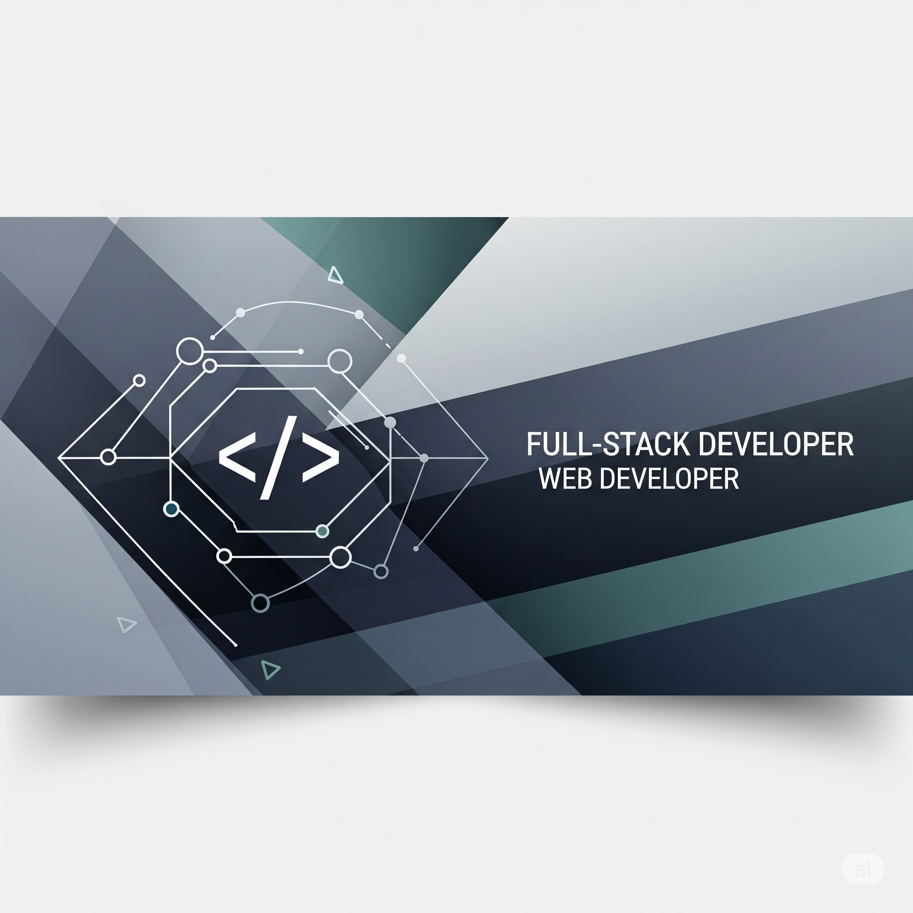

  

# Indrajeet Sunil Chavan
### Full-Stack Engineer | Building scalable applications from server to screen.

I'm an Aspiring Full Stack Developer passionate about end-to-end app development. I'm a technology enthusiast with strong foundational knowledge in mobile app development, UI/UX design, and backend integration. I am seeking an opportunity to contribute my technical skills and creativity to innovative software projects.

Feel free to check out my projects and contributions below!

### 💻 Technologies & Tools

Here are some of the technologies I work with:

* **Programming Languages:** Java, Python, C
* **Web Technologies:** HTML, CSS, JavaScript
* **Android Tools:** Flutter, Android Studio, Room Database, Firebase
* **APIs & Networking:** REST APIs, JSON
* **Tools & Platforms:** Git, GitHub
  
Connect with Me

## 🚀 My Projects

  <!-- Portfolio -->
  
  
  <!-- Freshee Cart -->
  
  
  <!-- Profile Repo -->
  
  
  <!-- InventoryPro -->
  

---

### Project Templates

#### 1️⃣ My Portfolio
- **Tech Stack:** HTML, CSS, JavaScript  
- **Description:** Personal portfolio website to showcase projects, skills, and resume.  
- **Live Link:** [View Here](https://indra2629.github.io/my-portfolio)  

#### 2️⃣ Freshee Cart
- **Tech Stack:** JavaScript, HTML, CSS  
- **Description:** E-commerce platform for managing cart and orders with dynamic UI.  
- **GitHub Link:** [View Repository](https://github.com/Indra2629/Freshee-Cart-)  

#### 3️⃣ Profile Repo
- **Tech Stack:** GitHub, Markdown  
- **Description:** Central repository for managing code snippets, personal projects, and documentation.  
- **GitHub Link:** [View Repository](https://github.com/Indra2629/Indra2629)  

#### 4️⃣ InventoryPro
- **Tech Stack:** Python, Tkinter, SQLite (or any DB)  
- **Description:** Inventory management system with analytics, stock tracking, and reporting.  
- **GitHub Link:** [View Repository](https://github.com/Indra2629/InventoryPro)  

## 🛠 My Tech Stack

  
  
  
  
  
  
  
  
  
  

